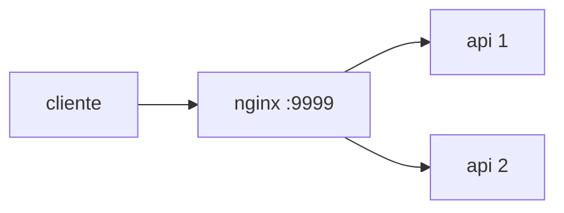
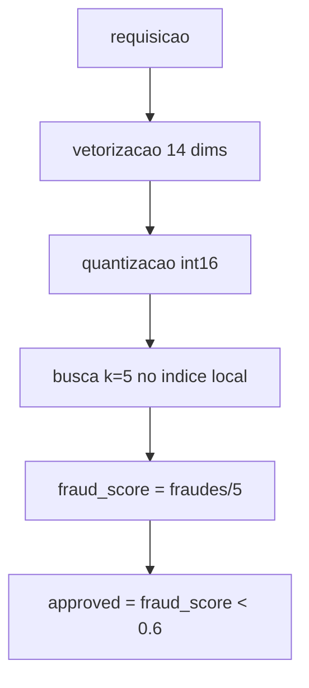
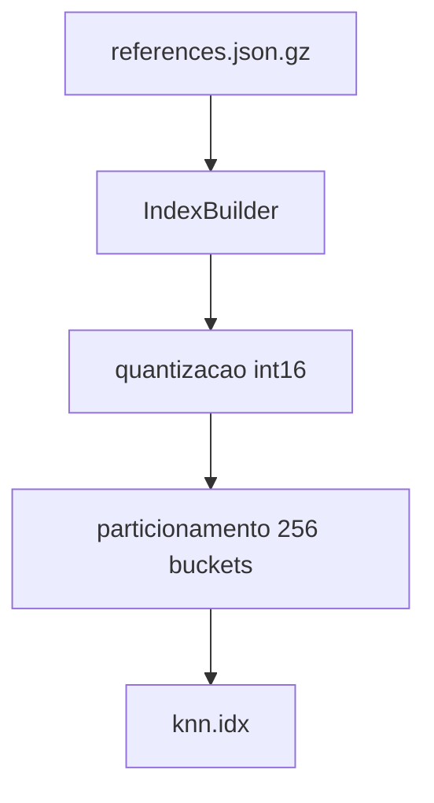

# Rinha de Backend 2026 - Fraud Detection (.NET)

Backend .NET para deteccao de fraude via busca vetorial sob as restricoes da Rinha.

## Visao geral

- API minimal em .NET 8, com vetorizacao conforme as regras oficiais.
- Busca vetorial com indice local em arquivo (mmap) para caber em memoria.
- Load balancer nginx com round-robin e 2 instancias da API.



## Endpoints

- `GET /ready` -> 200 quando o indice estiver carregado
- `POST /fraud-score` -> recebe 1 payload por requisicao

## Como funciona



### Vetorizacao (resumo)

- 14 dimensoes com clamp em [0,1]
- `last_transaction: null` -> indices 5 e 6 com -1
- `unknown_merchant` -> 1 se merchant nao estiver em known_merchants
- `mcc_risk` vem de `mcc_risk.json` (default 0.5)

Regras completas: [docs/REGRAS_DE_DETECCAO.md](docs/REGRAS_DE_DETECCAO.md)

## Indice local (mmap)

O indice e um arquivo binario que armazena vetores quantizados e particionados.
Isso permite leitura rapida sem carregar tudo em RAM.



Formato (alto nivel):

- Header: magic, escala, dims, count
- Tabela de particoes (min/max por dimensao)
- Vetores quantizados (int16)
- Labels (0/1)

## Rodando localmente

1) Garanta a pasta `./resources` com:
- `references.json.gz`
- `normalization.json`
- `mcc_risk.json`

2) Gere o indice:
```bash
dotnet run --project src/Rinha.FraudDetection.Tools build
```
Gera `data/knn.idx`.

3) Suba o compose:
```bash
docker compose up
```

## Teste rapido (k6)

O p99 aparece no resumo do k6 em `http_req_duration`.

```bash
k6 run test-k6.js
```

## Variaveis de ambiente

- `RESOURCES_PATH` (default: `/app/resources`)
- `INDEX_PATH` (default: `/app/data/knn.idx`)

## Estrutura do repo

```
src/
   Rinha.FraudDetection.Domain
   Rinha.FraudDetection.Application
   Rinha.FraudDetection.Infrastructure
   Rinha.FraudDetection.Presentation
   Rinha.FraudDetection.Tools
```

## Docker e restricoes

O `docker-compose.yml` segue as regras de topologia da Rinha:
- 1 load balancer + 2 APIs
- porta 9999 no LB
- limites totais dentro de 1 CPU e 350 MB

## Submissao

Para a branch `submission`, use apenas os arquivos necessarios para o teste:

```
branch-submission/
   docker-compose.yml
   nginx.conf
   info.json
```

Docs oficiais: [docs/ARQUITETURA.md](docs/ARQUITETURA.md)
